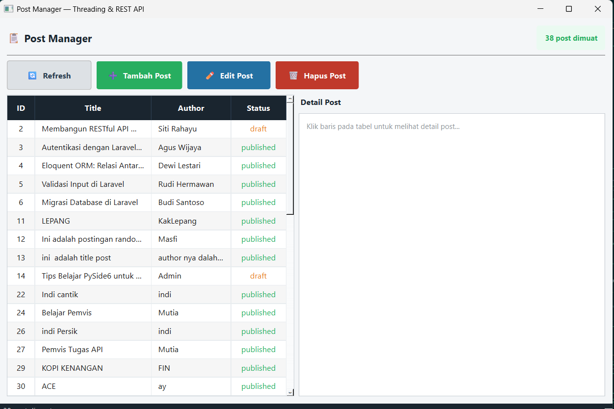
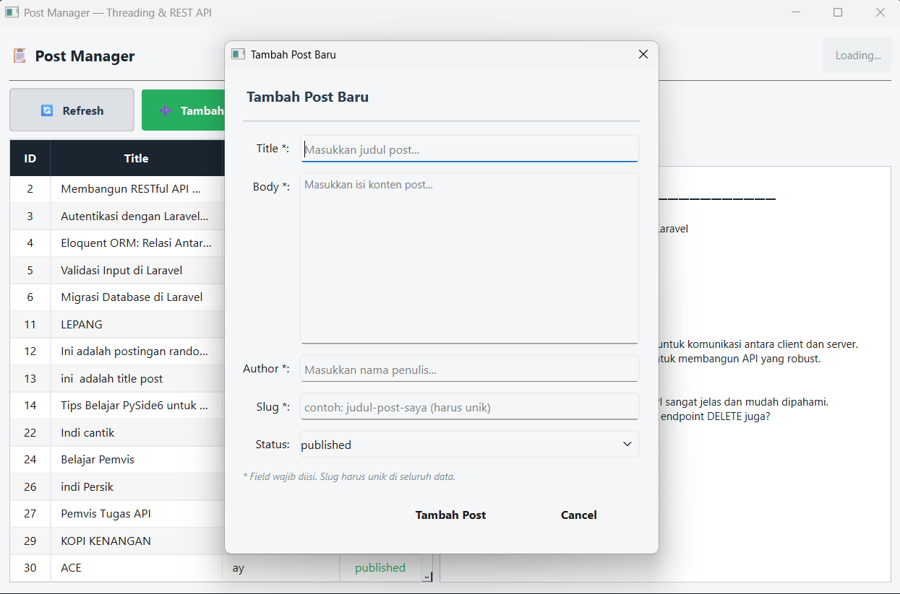
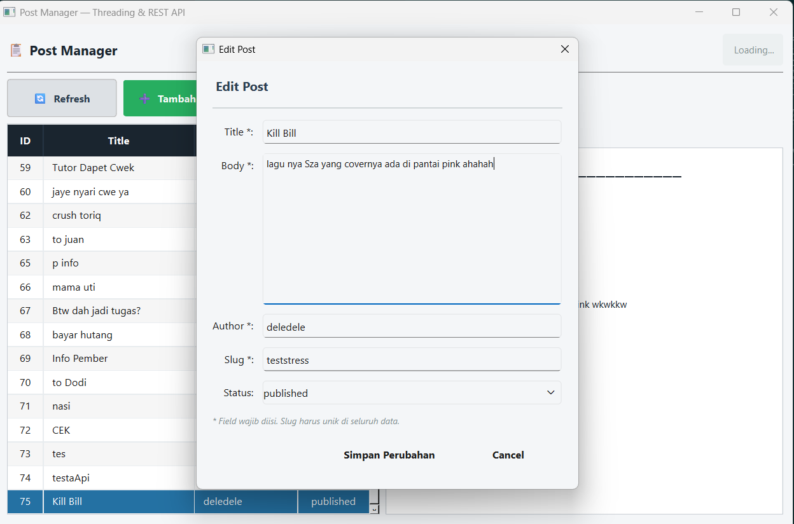
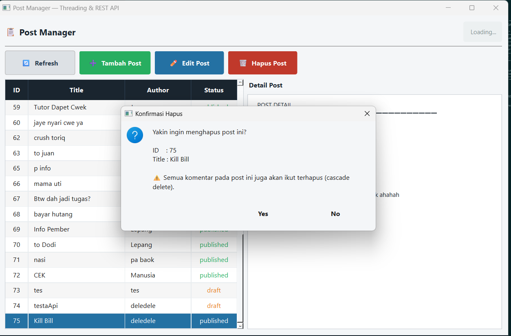

# Tugas 5 — Threading & REST API

**Nama  :** Baiq Adelia Dwi Savitri
**NIM   :** F1d02310006
**Kelas :** D
**Mata Kuliah :** Pemrograman Visual

---

## Deskripsi Tugas

Aplikasi desktop **Post Manager** yang dibangun menggunakan PySide6. Tugas ini mengimplementasikan dua konsep utama dari materi minggu ini, yaitu **Multi-Threading** dan **REST API**.

Aplikasi ini bisa melakukan operasi CRUD lengkap (Create, Read, Update, Delete) terhadap data post melalui API `https://api.pahrul.my.id/api/posts`. Semua request ke server dijalankan di thread terpisah supaya tampilan aplikasi tidak freeze saat menunggu response.


## Fitur Aplikasi

**1. Tampilkan Daftar Posts**
Saat aplikasi dibuka, data post langsung diambil dari server via GET dan ditampilkan dalam tabel berkolom ID, Title, Author, dan Status.

**2. Detail Post**
Klik baris manapun di tabel, panel sebelah kanan akan otomatis menampilkan detail lengkap post tersebut termasuk daftar comments-nya.

**3. Tambah Post**
Klik tombol "Tambah Post" untuk membuka form input. Isi title, body, author, slug, dan status lalu simpan. ID baru dari server akan ditampilkan sebagai konfirmasi.

**4. Edit Post**
Pilih post dari tabel lalu klik "Edit Post". Form akan terbuka dengan data lama yang sudah terisi, tinggal ubah bagian yang perlu diperbarui.

**5. Hapus Post**
Pilih post dari tabel lalu klik "Hapus Post". Akan muncul dialog konfirmasi sebelum data benar-benar dihapus. Semua komentar pada post tersebut juga ikut terhapus (cascade delete).

**6. Threading**
Semua request ke API berjalan di worker thread terpisah. UI tidak pernah freeze — tombol tetap bisa diklik dan tampilan tetap responsif selama request berlangsung.

**7. State Handling**
Status request ditampilkan dengan warna berbeda: biru saat loading, hijau saat sukses, merah saat error.

**8. Validasi**
Jika slug sudah dipakai (error 422 dari server), pesan validasi akan ditampilkan ke user.


## Struktur File
Proyek ini menggunakan prinsip **Separation of Concerns (SoC)** — setiap file punya tanggung jawab yang berbeda dan tidak saling bercampur.

```
post_manager/
├── api_service.py
├── api_worker.py
├── dialogs.py
├── main.py
└── README.md
```

**api_service.py** — berisi semua logika HTTP request (GET, POST, PUT, DELETE). File ini murni Python biasa, tidak ada kode Qt sama sekali, sehingga bisa diuji langsung dari terminal tanpa harus membuka UI.

**api_worker.py** — bertugas menjalankan method dari api_service di thread terpisah menggunakan QThread. File ini adalah jembatan antara proses network dan tampilan UI.

**dialogs.py** — berisi form dialog untuk Tambah dan Edit post. Dipisah dari main.py supaya kode UI utama tidak terlalu penuh.

**main.py** — window utama yang menghubungkan semua komponen. Berisi tampilan tabel, tombol-tombol aksi, panel detail, dan logika state handling.

## Screenshot

### Tampilan Utama


### Form Tambah Post


### Form Edit Post


### Dialog Konfirmasi Hapus



## Konsep yang Diimplementasikan
**QThread + Worker Pattern**
Setiap kali user klik tombol, main.py tidak langsung memanggil requests.get(). Alurnya adalah main.py meminta api_worker untuk menjalankan tugas, worker lalu memanggil api_service di thread terpisah, hasil dikirim balik ke UI via Signal.

**HTTP Methods**
- GET /api/posts — mengambil semua post
- GET /api/posts/{id} — mengambil detail post beserta comments
- POST /api/posts — membuat post baru
- PUT /api/posts/{id} — memperbarui data post
- DELETE /api/posts/{id} — menghapus post beserta comments

**Mengapa Signal, bukan langsung update widget?**
Qt tidak mengizinkan worker thread mengubah widget secara langsung karena bisa menyebabkan crash. Solusinya adalah worker mengirim data via Signal, lalu Qt yang mengurus eksekusinya di main thread secara aman.